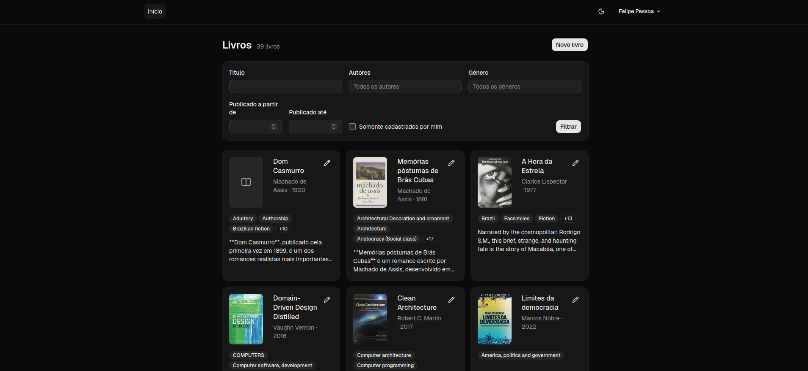
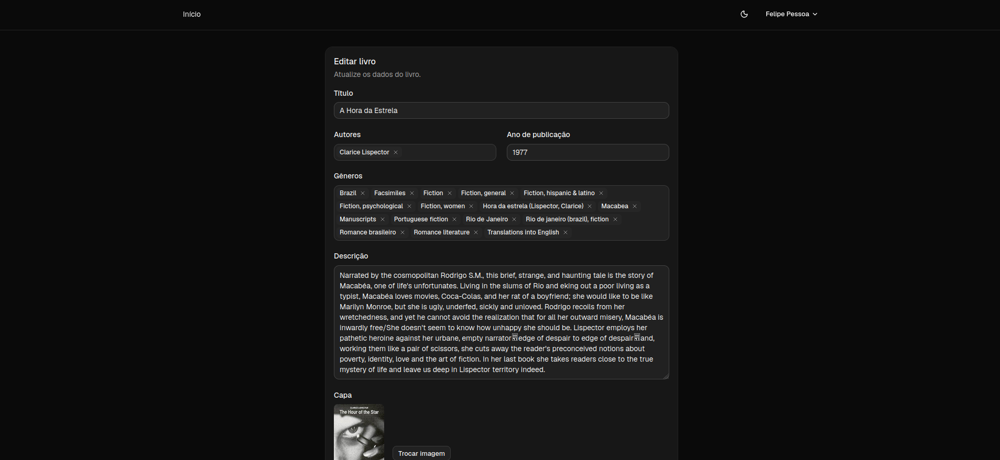

# Book Catalog

Catálogo de livros feito com Rails, Inertia e React, com importação de dados da Open Library.

## Sumário

- [Telas](#telas)
- [Checklist do desafio](#checklist-do-desafio)
- [Decisões técnicas](#decisões-técnicas)
  - [Indisponibilidade ou resposta vazia da Open Library](#indisponibilidade-ou-resposta-vazia-da-open-library)
- [Dev Container](#dev-container)
- [CI](#ci)
- [Kubernetes local](#kubernetes-local)

## Telas





## Checklist do desafio

### Acesso público

- [x] Lista paginada de livros, do mais recente para o mais antigo (Kaminari)
- [x] Filtros por autor, gênero e ano de publicação, além de título
- [x] Cabeçalho com **Criar conta**/**Login**, e nome do usuário quando logado

### Área logada

- [x] Cadastrar, editar e remover livros, só os próprios (CanCanCan)
- [x] Filtro "meus livros"
- [ ] Endpoint JSON `/books.json` listando os livros

### Fluxo de cadastro

- [x] Backend consulta a Open Library com HTTParty (`OpenLibrary::Client`)
- [x] Frontend em React + TypeScript via Inertia exibe os resultados e permite a seleção
- [x] A seleção preenche autor, ano, gêneros, descrição e capa

### Decisões técnicas em aberto

- [ ] Cadastro duplicado de livros: ainda sem regra definida
- [x] Open Library indisponível ou sem resultados: o backend responde `502` e o formulário mostra a mensagem de erro ou de "nenhum resultado"
- [ ] Nível de acesso ao `/books.json`

### Requisitos técnicos

- [x] Rails 7+ (8.1) e Ruby 3.3+ (4.0)
- [x] React + TypeScript integrado via Inertia.js
- [x] PostgreSQL
- [x] Testes com RSpec cobrindo models, requests, system specs e a Open Library com WebMock
- [x] Testes do frontend com Vitest
- [x] Ambiente com Docker e Docker Compose, pelo [Dev Container](#dev-container) (`.devcontainer/compose.yaml`)
- [x] Commit inicial com o boilerplate do Rails isolado
- [x] Gem de autorização para as regras de edição (CanCanCan)

### Diferenciais

- [x] [CI](#ci) no GitHub Actions com RuboCop, Brakeman, bundler-audit, RSpec e Vitest
- [x] Manifests de Deployment/Service do Kubernetes (`k8s/`), com instruções em [Kubernetes local](#kubernetes-local)
- [x] Paginação com Kaminari
- [ ] Cache básico
- [ ] Logging estruturado

### README

- [x] Instruções de como rodar
- [ ] Seção de decisões técnicas (as três situações em aberto e as escolhas de arquitetura)
- [ ] Seção "Com mais tempo"
- [ ] Seção sobre o uso de IA, com pelo menos um exemplo de sugestão incorreta e a correção

## Decisões técnicas

### Indisponibilidade ou resposta vazia da Open Library

A Open Library serve para preencher o formulário, mas o cadastro não depende dela. Se a API falhar, a pessoa continua conseguindo cadastrar o livro digitando os dados à mão, porque todos os campos do formulário são editáveis e só o título é obrigatório.

**Backend**

- O `OpenLibrary::Client` usa timeout de 5 segundos e converte qualquer falha num único erro, `OpenLibrary::Client::Error`: erro de rede, timeout, SSL, status diferente de 2xx ou JSON inválido. Assim, quem usa o client só precisa tratar um tipo de erro.
- O `OpenLibrary::BooksController` transforma esse erro numa resposta `502 Bad Gateway`, com uma mensagem traduzida. O `502` deixa claro que a falha é do serviço externo, e não da aplicação nem da requisição.
- Buscas com menos de 3 caracteres devolvem `[]` sem consultar a API.
- O endpoint tem rate limit de 30 requisições por minuto, para não sobrecarregar a Open Library nem estourar o limite dela.

**Frontend**

- A busca por título tem debounce de 400 ms e cancela a requisição anterior quando a pessoa continua digitando.
- Abaixo do campo de título aparece "Buscando na Open Library..." durante a busca, "Não foi possível consultar a Open Library." quando a API falha e "Nenhum livro encontrado na Open Library." quando não há resultados. Em todos os casos o título digitado continua no campo, e o formulário pode ser enviado normalmente.
- A descrição é buscada numa segunda requisição, depois que a pessoa escolhe um resultado. Se essa requisição falhar, a descrição fica em branco e o resto dos dados escolhidos continua preenchido.

**Capa**

- A capa não é baixada durante o cadastro. O livro é salvo com o id da capa da Open Library, e o `Book::AttachOpenLibraryCoverJob` baixa a imagem em segundo plano. Assim, o cadastro não fica lento nem falha por causa da capa.
- Se o download falhar, o job tenta de novo até 3 vezes, com intervalos cada vez maiores. Enquanto a capa não é baixada, a listagem mostra a imagem direto da Open Library.

## Dev Container

Ambiente de desenvolvimento em Docker, configurado em `.devcontainer/`. Segue o guia oficial do Rails: [Getting Started with Dev Containers](https://guides.rubyonrails.org/getting_started_with_devcontainer.html).

### Serviços

| Serviço     | Função                                                | Porta no host             |
| ----------- | ----------------------------------------------------- | ------------------------- |
| `rails-app` | Ruby, Node e o código do projeto                      | 3000 (Rails), 3036 (Vite) |
| `postgres`  | PostgreSQL 16, com os dados no volume `postgres-data` | —                         |
| `selenium`  | Chromium para os system specs                         | —                         |

As portas ficam acessíveis só em `127.0.0.1`.

### Pré-requisitos

- Docker com Docker Compose
- Formas de abrir o Dev Container:
  - **VS Code** com a extensão Dev Containers, ou **RubyMine**: abrem o projeto direto no container, sem instalar mais nada.
  - **Terminal**: precisa de Node/npm no host, para rodar a CLI do Dev Container via `npx`.

Opcional: instalar a CLI globalmente e criar um alias no `~/.bashrc`:

```bash
npm i -g @devcontainers/cli
alias dc='devcontainer exec --workspace-folder .'
```

Com o alias, basta trocar `npx @devcontainers/cli exec --workspace-folder .` por `dc` nos comandos abaixo.

### Subir o ambiente

No VS Code, use o comando **Dev Containers: Reopen in Container**. Depois disso, os comandos das seções abaixo rodam direto no terminal integrado, sem o prefixo `npx @devcontainers/cli exec --workspace-folder .`.

Pelo terminal, rode a partir da raiz do projeto:

```bash
npx @devcontainers/cli up --workspace-folder .
```

Na primeira execução, o comando constrói a imagem e roda o `bin/setup --skip-server`, que instala as gems e os pacotes npm e prepara o banco.

Depois de alterar algo em `.devcontainer/`, recrie o container. No VS Code, use o comando **Dev Containers: Rebuild Container**. Pelo terminal:

```bash
npx @devcontainers/cli up --workspace-folder . --remove-existing-container
```

### Rodar a aplicação

```bash
npx @devcontainers/cli exec --workspace-folder . bin/dev
```

Acesse em http://localhost:3000. Para encerrar, use `Ctrl+C`.

### Rodar comandos no container

```bash
npx @devcontainers/cli exec --workspace-folder . bundle exec rspec
npx @devcontainers/cli exec --workspace-folder . bin/rails console
npx @devcontainers/cli exec --workspace-folder . bin/rails db:migrate
```

Para abrir um shell dentro do container:

```bash
npx @devcontainers/cli exec --workspace-folder . bash
```

#### Evite `docker exec` e `docker compose exec`

Esses comandos não carregam o mise, que gerencia o Ruby no container, e falham com `gem: not found`. Se precisar usá-los, entre como o usuário `vscode` e ative o mise:

```bash
docker compose -p book_catalog exec -u vscode rails-app bash -c 'eval "$(mise activate bash)" && bin/rails console'
```

### Desligar

| Comando                                  | Efeito                                    |
| ---------------------------------------- | ----------------------------------------- |
| `docker compose -p book_catalog stop`    | Para os containers e mantém tudo.         |
| `docker compose -p book_catalog down`    | Remove os containers e mantém o banco.    |
| `docker compose -p book_catalog down -v` | Remove os containers **e apaga o banco**. |

Depois de um `stop` ou `down`, volte com `npx @devcontainers/cli up --workspace-folder .`.

### Status e logs

```bash
docker compose -p book_catalog ps
docker compose -p book_catalog logs -f postgres
```

### Observações

- **IDE:** o VS Code (extensão Dev Containers) e o RubyMine abrem o projeto direto no container. Neles, o terminal integrado já roda dentro do container.
- **System specs:** dentro do container, os specs usam o Chrome remoto do serviço `selenium`. As variáveis `SELENIUM_HOST` e `CAPYBARA_SERVER_PORT` ativam esse modo, e a configuração está em `spec/support/system.rb`.
- **Imagem de produção:** o `Dockerfile` da raiz é o de produção, usado no Kubernetes (veja [Kubernetes local](#kubernetes-local)), e não é usado neste ambiente.

## CI

O CI roda no GitHub Actions (`.github/workflows/ci.yml`) em todo pull request e a cada push na `main`.

| Job         | O que faz                                                                |
| ----------- | ------------------------------------------------------------------------ |
| `scan_ruby` | Brakeman e bundler-audit                                                 |
| `lint`      | RuboCop                                                                  |
| `test`      | RSpec com Postgres, incluindo os system specs, e cobertura com SimpleCov |
| `frontend`  | Checagem de tipos (`npm run check`) e testes do Vitest com cobertura     |

Os jobs `test` e `frontend` publicam no commit os status `coverage-ruby` e `coverage-frontend`, com a porcentagem de linhas e branches cobertos. O relatório do SimpleCov fica disponível como artifact `coverage` e, se algum system spec falhar, os screenshots ficam no artifact `screenshots`.

### Rodar localmente

O `bin/ci` roda as mesmas verificações do GitHub Actions, com os passos definidos em `config/ci.rb`: setup, RuboCop, bundler-audit, Brakeman, RSpec, checagem de tipos, Vitest e seeds.

### Cobertura

| Parte    | Ferramenta           | Configuração           | Mínimo                                                             | Relatório                      |
| -------- | -------------------- | ---------------------- | ------------------------------------------------------------------ | ------------------------------ |
| Rails    | SimpleCov            | `spec/rails_helper.rb` | 98% de linhas e 95% de branches                                    | `coverage/index.html`          |
| Frontend | Vitest (provider v8) | `vitest.config.ts`     | 99% de linhas, 95% de branches, 98% de statements e 96% de funções | `coverage/frontend/index.html` |

- **SimpleCov:** mede sempre a cobertura, mas só exige o mínimo quando a variável `CI` está definida. O GitHub Actions e o `bin/ci` definem essa variável. Para exigir o mínimo num `rspec` avulso, use `CI=true bundle exec rspec`.
- **Vitest:** exige o mínimo sempre que roda com `--coverage`. Os componentes do Shadcn (`components/ui`), os entrypoints, os tipos e os próprios testes ficam fora da conta.
- **Mínimo do Vitest sobe sozinho:** com o `autoUpdate`, quando a cobertura passa do mínimo o Vitest reescreve os valores em `vitest.config.ts`. Se o arquivo mudar depois de rodar os testes, commite a mudança junto.
- **Relatórios:** a pasta `coverage/` fica no projeto (e no `.gitignore`), então dá para abrir os HTML direto no navegador do host.

## Kubernetes local

Roda a imagem de produção do projeto (`Dockerfile` da raiz) num cluster Kubernetes local com o kind. Os manifests ficam em `k8s/`.

### Manifests

| Arquivo              | Função                                                              |
| -------------------- | ------------------------------------------------------------------- |
| `configmap.yml`      | `DB_HOST`, `SOLID_QUEUE_IN_PUMA`, `HTTP_PORT` e `RAILS_LOG_LEVEL`   |
| `secret.example.yml` | Modelo do Secret. Só referência, não aplicar.                       |
| `pvc.yml`            | Volume de 5Gi para `/rails/storage`, onde ficam as capas            |
| `deployment.yml`     | App Rails com 1 réplica, porta 8080 e probes em `/up`               |
| `service.yml`        | Expõe a app na porta 80 dentro do cluster                           |
| `postgres.yml`       | PostgreSQL 17 com volume próprio, só para uso local                 |
| `ingress.yml`        | Ingress nginx. Não é usado no kind, que não tem Ingress controller. |

### Pré-requisitos

- Docker
- `kubectl`
- `kind`, com um cluster criado (`kind create cluster`). O cluster padrão se chama `kind`.

### Subir o ambiente

Rode a partir da raiz do projeto.

1. Gerar a imagem e carregar no cluster:

   ```bash
   docker build -t book_catalog:latest .
   kind load docker-image book_catalog:latest
   ```

2. Criar o Secret (só na primeira vez):

   ```bash
   kubectl create secret generic book-catalog \
     --from-file=RAILS_MASTER_KEY=config/master.key \
     --from-literal=BOOK_CATALOG_DATABASE_PASSWORD=senha-local
   ```

3. Subir o Postgres e esperar ficar pronto:

   ```bash
   kubectl apply -f k8s/postgres.yml
   kubectl wait --for=condition=ready pod -l app=postgres --timeout=120s
   ```

4. Subir a aplicação:

   ```bash
   kubectl apply -f k8s/configmap.yml -f k8s/pvc.yml -f k8s/deployment.yml -f k8s/service.yml
   kubectl rollout status deployment/book-catalog
   ```

5. Acessar:

   ```bash
   kubectl port-forward svc/book-catalog 3000:80
   ```

   Acesse em http://localhost:3000.

> [!WARNING]
> Não use `kubectl apply -f k8s/`: aplicar a pasta inteira inclui o `secret.example.yml` e substitui o Secret real pelos valores de exemplo. Aplique os arquivos um a um, como acima.

### Atualizar depois de mudar o código

```bash
docker build -t book_catalog:latest .
kind load docker-image book_catalog:latest
kubectl rollout restart deployment/book-catalog
```

### Rodar comandos no container

```bash
kubectl exec -it deployment/book-catalog -- ./bin/rails console
kubectl exec -it deployment/book-catalog -- ./bin/rails console --sandbox
kubectl exec -it deployment/book-catalog -- bash
kubectl exec -it statefulset/postgres -- psql -U book_catalog book_catalog_production
```

### Status e logs

```bash
kubectl get pods
kubectl logs -f deployment/book-catalog
kubectl describe pod -l app=book-catalog
```

### Desligar

| Comando                                                   | Efeito                                                     |
| --------------------------------------------------------- | ---------------------------------------------------------- |
| `kubectl delete -f k8s/deployment.yml -f k8s/service.yml` | Remove a app e mantém o banco e as capas.                  |
| `kubectl delete -f k8s/postgres.yml`                      | Remove o Postgres. O volume dele continua existindo.       |
| `kind delete cluster`                                     | Apaga o cluster inteiro, **inclusive o banco e as capas**. |

### Observações

- **Jobs:** o Solid Queue roda dentro do Puma (`SOLID_QUEUE_IN_PUMA=true`), então não existe um pod separado para os jobs.
- **Uma réplica:** as capas ficam em disco local num volume `ReadWriteOnce`, por isso o Deployment usa 1 réplica e a estratégia `Recreate`. Para escalar, é preciso trocar o Active Storage para S3, mover o Solid Queue para um Deployment próprio (`./bin/jobs`) e as migrações para um initContainer ou Job.
- **Imagem:** o build instala o Node 24 só no estágio `build`, para o Vite compilar os assets. A imagem final não tem Node nem `node_modules`.
- **Cluster real:** a imagem precisa vir de um registry, com uma tag de versão. Dá para trocar na hora do deploy com `kubectl set image deployment/book-catalog web=<registry>/book_catalog:<versao>`, ou com Kustomize.
- **Dev container:** rode `kind` e `kubectl` no host, não dentro do dev container, que não tem acesso ao Docker do host.
